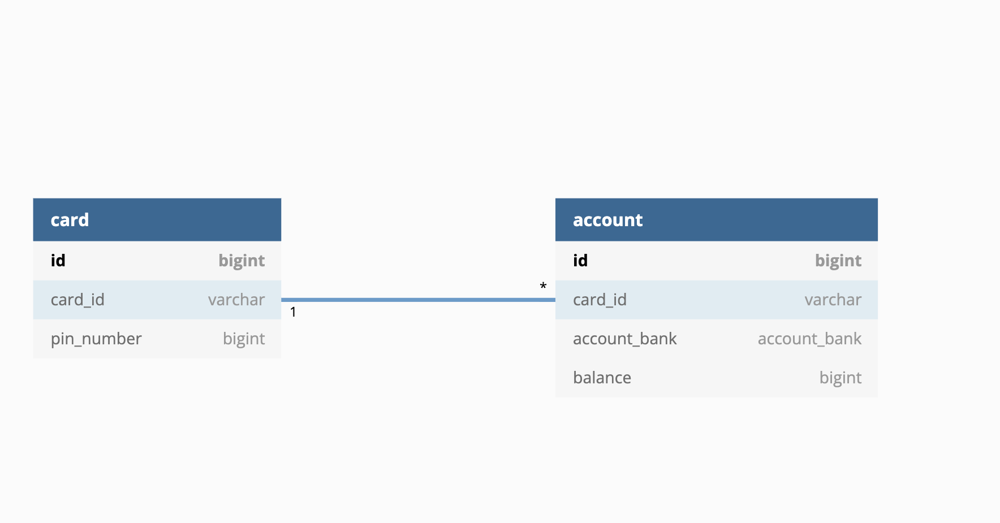

<H1><b>MAKE ATM CONTROLLER PROTOTYPE</b></H1>

<H3>Used Skills</H3>

- Java `open jdk 11`
- Spring Boot `2.5.5`
- Gradle `7.1.1`
- JPA `2.5.6`
- H2 in memory DB(Embedded)
- lombok
- springboot-starter-validation
- springboot-starter-jdbc

<H3>Simple ERD Image</H3>

<H3>How To Build Application</H3>

<pre><code>gradle build</code></pre>

- By using above command then you can build <code>jar</code>

- Check jar file located on <code>./build/libs/</code>

<pre><code>java -jar ATM-bear-robotics.jar</code></pre>

- You can run jar file by using above command

<pre><code>bash atm-daemon.sh</code></pre>

- You can use bash shell script for executing jar on daemon environment and for building jar file
- You can also check the pid of <code>jar</code> by using above command

<H3>How To Use Controller</H3>

- All controllers I've coded is `@PostMapping`
  
  - So, if you want to test controller method, you also need to send `@RequestBody(Formed data.dto.PostRequestBody)`  which is satisfied the constraints defined on class member variable
  
  - And, also you need to send `@RequestParm` which is single String of `card_id(one of column defined on data.dto.entity.card)`

> Controller's Http Address(Request just Show address)
> 
> 
> http://localhost:8080/api/show?id=card_3

>`{
"pin_number": 1236,
"account_bank": "SHINHAN",
"money": 0
}`

<H3>How To Run Test Code of Controller</H3>

    gradle test -Dtest=ATMControllerTest

- If you run above command then you can test all of tests method I coded

<pre><code>gradle test -Dtest=ATMControllerTest#[method-name]
</code></pre>

- If you run above command then you can test each test method by method name I coded

<H3>Check Data on Console</H3>

- You can see real data on database schema by connecting to bottom address

> http://localhost:8080/h2-console

- And you need to type username which was defined in `resources/application.yml`

<H3>In Memory DB Data</H3>

- If you want to know initialize data of H2 Database, then open `resources/import.sql`

- But, you can't do insert or delete initialize data of H2 Database

<H3>Careful Things</H3>

- All addresses those prefixed as `http://localhost` can be accessed after run `SpringBoot Application`
